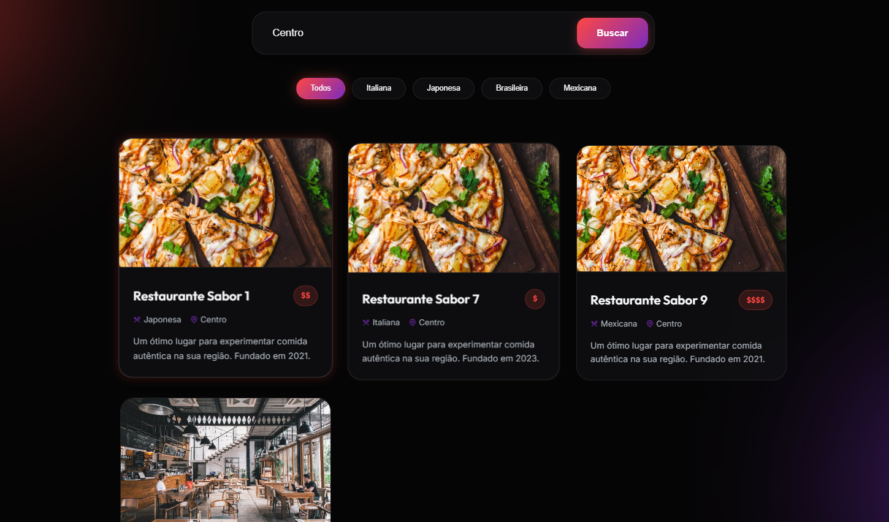

# Atividade 1: Fundamentos e Características da Qualidade no LocalEats

## 1. Identificação

- **Unidade Curricular:** Qualidade de Software
- **Metodologia:** Problem-Based Learning (PBL)
- **Projeto:** LocalEats
- **Modalidade:** Individual
- **Integrante:** Guilherme Pinheiro

## Tarefa 1 — Fundamentos da qualidade

### Necessidades explícitas e implícitas

| Tipo | Necessidade | Interessado | Consequência se não for atendida |
|---|---|---|---|
| Explícita | O usuário deve conseguir pesquisar restaurantes por especialidade ou localização. | Usuário | O usuário pode não conseguir encontrar restaurantes de interesse, prejudicando a descoberta e a utilização da aplicação. |
| Explícita | O usuário deve conseguir fazer pedidos pelos restaurantes disponíveis. | Usuário | O usuário não consegue concluir a principal ação de consumo da aplicação. |
| Implícita | As informações apresentadas na pesquisa devem ser coerentes e permitir que o usuário encontre resultados compatíveis com o termo ou localização informados. | Usuário e negócio | Resultados inadequados podem gerar frustração, escolhas incorretas e perda de confiança no sistema. |
| Implícita | Os dados da conta e das ações realizadas pelo usuário devem ser tratados de forma segura. | Usuário e negócio | Pode haver exposição ou uso indevido de informações, comprometendo a confiança e a qualidade percebida do sistema. |

### Resposta

Sim. Um sistema pode implementar todas as funcionalidades explicitamente solicitadas e ainda apresentar baixa qualidade. Por exemplo, a pesquisa pode existir, mas retornar resultados incoerentes com a especialidade ou localização informada. Nesse caso, a funcionalidade está presente, porém não atende adequadamente à necessidade implícita de obter resultados úteis e confiáveis.

## Tarefa 2 — Exploração da aplicação

**Funcionalidade escolhida:** Pesquisar restaurantes por especialidade ou localização.

> **Observação sobre evidência:** a atividade exige uma captura de tela ou gravação da exploração real. Como os arquivos enviados não contêm essa evidência e a execução da aplicação não foi realizada nesta etapa, não é correto inventar um resultado observado. A tabela abaixo define exatamente a exploração que deve ser executada e registrada.

| Integrante | Funcionalidade | O que foi realizado | O que foi observado | Evidência |
|---|---|---|---|---|
| Guilherme Pinheiro | Pesquisar restaurantes por especialidade ou localização | **Utilização esperada:** informar uma especialidade ou localização válida no campo de pesquisa e verificar os restaurantes apresentados. **Utilização alternativa:** realizar a pesquisa com um termo vazio ou com um termo para o qual não existam resultados. | **A preencher após a execução:** registrar somente o comportamento efetivamente observado na interface, incluindo se os resultados são compatíveis com a pesquisa e como o sistema trata uma pesquisa sem resultados/entrada incompleta. |  |

## Tarefa 3 — Requisitos e características de qualidade

| Integrante | Requisito de qualidade | Característica ou subcaracterística | Justificativa | Como avaliar |
|---|---|---|---|---|
| Guilherme Pinheiro | Ao pesquisar restaurantes por especialidade ou localização, o sistema deve apresentar resultados coerentes com o termo informado e permitir que o usuário compreenda facilmente os resultados encontrados. | **Adequação funcional (Functional Suitability)** | A qualidade predominante está relacionada à capacidade da funcionalidade de produzir resultados que atendam à finalidade da pesquisa. Para o LocalEats, não basta existir um campo de pesquisa: os resultados precisam ser pertinentes à necessidade do usuário. | Realizar pesquisas com diferentes especialidades e localizações válidas, além de termos sem correspondência, e comparar os resultados exibidos com o critério informado. |

### Uso de inteligência artificial

**Ferramenta utilizada:** ChatGPT.

**Como foi utilizada:** utilizada como apoio para interpretar as instruções da atividade, estruturar as respostas, sugerir necessidades, riscos e formas de avaliação e revisar a clareza do texto.

**Como as respostas foram verificadas:** as respostas foram comparadas com as instruções do arquivo da atividade. Também foram mantidas somente propostas relacionadas às funcionalidades explicitamente descritas para o LocalEats.

**Observação:** a evidência da exploração da aplicação deve ser produzida pelo integrante durante o acesso real ao LocalEats; não foi fabricado um resultado de execução.
